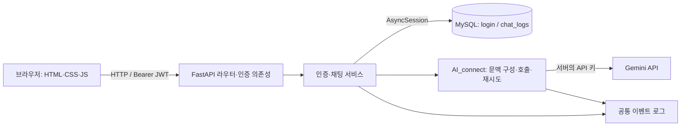

# 담다 — 웹 기반 AI 챗봇

로그인한 사용자의 질문을 Gemini API에 전달하고, 방별 대화와 처리 상태를 MySQL에 저장한다. 같은 방의 최근 성공 대화를 다음 질문의 문맥으로 사용한다.

- 저장소: [dori943/chatbot-service](https://github.com/dori943/chatbot-service)
- 상세 문서: [변경 명세](docs/refactoring.md) · [테스트 가이드](docs/testing-guide.md) · [협업 규칙](.github/CONTRIBUTING.md)

## 프로젝트 개요

| 항목 | 내용 |
|---|---|
| 문제 정의 | 사용자별 기록과 후속 질문의 문맥을 유지하는 AI 채팅 서비스 |
| 대상 사용자 | 개념 설명, 글 작성, 코드 예시 등을 한국어로 질문하는 사용자 |
| 핵심 시나리오 | 가입·로그인 → 질문·답변 → 같은 방에서 후속 질문 → 기록 조회·삭제 |
| 기술 | FastAPI, JavaScript, SQLAlchemy AsyncSession, MySQL 8.0, Gemini API, Docker Compose |

질문은 AI 호출 전에 처리 중으로 저장하고 완료 시 같은 기록을 갱신한다. 실패한 질문도 기록에 남는다.

## 시스템 구조

| 위치 | 역할 |
|---|---|
| templates/, static/ | 화면, 인증·채팅 상태, 서버 통신 |
| app/routers/, app/core/ | API 경로, 인증, 오류·요청 로그 |
| app/services/ | 입력 검증·처리 순서, DB 조회·저장, AI 호출·문맥 |
| app/models/, app/db.py | 테이블 매핑과 요청별 AsyncSession |
| app/schemas/, app/utils/ | 요청 타입, 비밀번호 해시, JWT 발급 |
| data/, scripts/, tests/ | 초기 테이블, 확인용 SQL, 자동 테스트 |

AI 키는 서버에서만 사용한다. AI 문맥은 같은 사용자·방의 최근 성공 대화 기본 5건이다.

## 실행 및 배포

.env.example을 .env로 복사해 DB 비밀번호, SECRET_KEY, AI_API_KEY를 설정한 뒤 저장소 루트에서 실행한다.

~~~sh
cp .env.example .env
docker compose up --build -d --wait
~~~

웹 화면: <http://127.0.0.1:8000> · API 문서: <http://127.0.0.1:8000/docs>

외부 배포는 공개 서버에서 같은 명령으로 실행하고 호스트 8000 포트의 접근을 허용한다. HTTPS 사용 시 프록시·도메인·인증서를 설정한다. 외부 접속 URL은 현재 저장소에 등록되지 않았다.

data/init.sql은 DB 볼륨의 최초 생성 시에만 실행된다. 재빌드해도 기존 데이터는 유지된다.

### 환경 변수

실제 키·비밀번호는 .env에만 저장한다. 전체 예시는 [.env.example](.env.example)을 참조한다.

| 키 | 용도·코드 기본값 |
|---|---|
| MYSQL_DATABASE, MYSQL_USER, MYSQL_PASSWORD, MYSQL_ROOT_PASSWORD | MySQL DB·계정·비밀번호 |
| SECRET_KEY | JWT 서명 키 |
| AI_API_KEY | 서버의 Gemini API 키 |
| AI_MODEL, AI_FALLBACK_MODEL | 주/대체 모델: gemini-3.8-flash / gemini-3.1-flash-lite |
| AI_TIMEOUT_SECONDS, AI_TOTAL_TIMEOUT_SECONDS, AI_MAX_RETRIES | 호출/전체 제한 10초/26초, 재시도 1회 |
| AI_CONTEXT_TURNS, MAX_CONTEXT_CHARS, MAX_QUESTION_LENGTH | 문맥 5턴/6,000자, 질문 최대 5,000자 |
| AI_MAX_TOKENS, AI_TEMPERATURE, AI_THINKING_LEVEL | 출력 800토큰, 온도 0.7, 추론 단계 low |

예시 파일의 APP_ENV, APP_HOST, APP_PORT, LOG_LEVEL, ACCESS_TOKEN_EXPIRE_MINUTES는 현재 앱에서 읽지 않는다. JWT 유효기간은 코드에서 60분이다.

## API 명세

채팅·기록 API는 Authorization: Bearer <token> 헤더가 필요하다. 사용자 ID는 JWT에서 가져온다.

| 메서드 | 경로 | 동작 |
|---|---|---|
| POST | /auth/register, /auth/login | 가입·로그인 후 JWT 발급 |
| POST | /api/chat | 질문 저장·AI 호출·결과 저장 |
| GET | /api/me/rooms | 본인 방 목록 |
| GET | /api/me/chats | 본인 전체 기록, 최신순 |
| GET | /api/me/chats?room_id=room-example | 해당 방 최근 5건 |
| GET | /api/me/chats?room_id=room-example&before_id=12 | ID 12보다 이전 기록 최대 5건 |
| DELETE | /api/me/chats?room_id=room-example | 해당 방 기록 삭제 |

가입·로그인은 같은 요청 형식이다. ID는 공백 제거 후 3~50자, 비밀번호는 8자 이상·UTF-8 72바이트 이하이다.

~~~http
POST /auth/register
Content-Type: application/json

{"id":"sample-user","pw":"example-only-password"}
~~~

~~~json
{"message":"register success","token":"<JWT>","token_type":"bearer"}
~~~

로그인 성공은 같은 형식이며 message는 login success다. 가입 성공 시에도 발급 토큰으로 바로 로그인한다.

~~~http
POST /api/chat
Authorization: Bearer <JWT>
Content-Type: application/json

{"room_id":"room-example","room_name":"첫 질문","question":"FastAPI란?"}
~~~

~~~json
{"id":12,"room_id":"room-example","room_name":"첫 질문","answer":"Python 웹 프레임워크입니다.","request_id":"예시-ID","created_at":"2026-10-02T01:00:00Z"}
~~~

방별 기록은 질문·답변 한 쌍이 1건이다. 처리 중·성공·실패를 모두 조회하며, 배열 마지막 ID를 before_id로 보내 이전 5건을 받는다.

~~~json
[{"id":12,"room_id":"room-example","room_name":"첫 질문","question":"FastAPI란?","answer":"Python 웹 프레임워크입니다.","status":"success","error_code":null,"created_at":"2026-10-02T01:00:00Z"}]
~~~

방 삭제 성공은 {"deleted":1}, 없는 방은 {"deleted":0}이다. 오류는 HTTP 상태와 함께 다음 형식으로 반환한다.

~~~json
{"error_code":"AI_TIMEOUT","message":"현재 응답이 지연되고 있어요. 잠시 후 다시 시도해 주세요.","request_id":"예시-ID"}
~~~

## DB 구조

[data/init.sql](data/init.sql)의 login.id와 chat_logs.user_id는 1:N 관계다. 방은 사용자 ID·방 ID로 구분한다.

| 테이블 | 필드 | 타입 | 내용 |
|---|---|---|---|
| login | id / pw | VARCHAR(50) PK / VARCHAR(255) | 사용자 ID / bcrypt 해시 |
| chat_logs | id / user_id | BIGINT PK / VARCHAR(50) FK | 기록 ID / 사용자 ID |
| chat_logs | room_id / room_name | VARCHAR(64) / VARCHAR(100) | 방 ID / 질문 당시 이름 |
| chat_logs | question / answer | VARCHAR(5000) / VARCHAR(5000) NULL | 질문 / 성공 답변 |
| chat_logs | status / error_code | VARCHAR(20) / VARCHAR(50) NULL | 처리 상태 / 실패 원인 |
| chat_logs | latency_ms / model | INT NULL / VARCHAR(80) NULL | AI 처리 시간 / 모델 |
| chat_logs | request_id / created_at | VARCHAR(64) / DATETIME(6) | 로그 연결 ID / UTC 생성 시각 |

서버 로그에는 요청 수신, AI 호출·결과, DB 저장 성공·실패가 남는다.

## DB 확인 방법

본인 기록은 로그인 토큰으로 GET /api/me/chats를 호출해 확인한다. 전체·사용자별 집계와 실패 기록은 기존 [검증 SQL](scripts/check_logs.sql)을 사용한다.

~~~sh
docker compose cp scripts/check_logs.sql db:/tmp/check_logs.sql
docker compose exec db mysql -u chatbot_user -p
~~~

MySQL에서 .env의 DB 이름으로 변경해 실행한다.

~~~sql
USE chatbot_db;
SOURCE /tmp/check_logs.sql;
~~~

SQL은 processing을 따로 세고 error·timeout만 실패로 집계한다. DB 기록과 서버 로그는 request_id로 연결한다.

## 팀 구성 및 작업 요약

역할은 [협업 규칙](.github/CONTRIBUTING.md)과 Git 이력을 기준으로 한다.

| 담당자 | 역할·작업 | 대표 커밋 |
|---|---|---|
| 채민성 | 프론트엔드: 화면, 인증·채팅 연결, 오류 안내 | [채팅 통신](https://github.com/dori943/chatbot-service/commit/ee6ab55) |
| 방승규 | 백엔드·구조: 인증, 비동기 DB, 기록·상태 복원, 화면 모듈 분리 | [비동기 DB](https://github.com/dori943/chatbot-service/commit/a380064) |
| 이건탁 | 백엔드·검증: 채팅 API, 본인 기록 조회, MySQL·브라우저 테스트 | [통합 테스트](https://github.com/dori943/chatbot-service/commit/66a654e) |
| 김도희 | AI: Gemini 연결, 문맥, 타임아웃, 재시도·폴백 | [AI 파이프라인](https://github.com/dori943/chatbot-service/commit/28d9400) |

기능 브랜치는 PR로 develop에 병합한다([PR 이력](https://github.com/dori943/chatbot-service/pulls)). 실제 .env, 키 파일, 로컬 DB·로그는 [.gitignore](.gitignore)로 제외한다.
