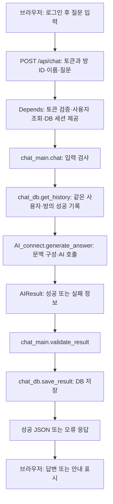

# 웹 기반 AI 챗봇 서비스 — 역할별 구술시험 예상 문답

과제 요구사항과 현재 프로젝트 코드를 연결한 학습용 문답지입니다. 실제 출제 문제나 공식 채점표는 아닙니다. 답변은 먼저 소리 내어 설명하고, 근거 링크에서 해당 함수와 테스트를 찾아보세요.

## 기준과 사용법

- 작성일: 2026-09-29
- 코드 기준: `refactor/bsg-back/app-refactoring`, `fcbb7e5c82c59996d92fd77c258b8e02fbfd2da3`
- 역할 기준: [팀 협업 문서](../../.github/CONTRIBUTING.md)의 역할표. 역할표는 개인별 실제 커밋·PR 기여의 증빙을 대신하지 않습니다.
- 답변의 구현 설명은 이 코드 기준입니다. 환경 변수의 실제 값, 배포 서버의 상태, 개인별 기여 실적은 따로 확인해야 합니다.
- 문답지 작성 과정에서는 앱·DB·실제 AI 테스트를 실행하지 않았습니다. 문서에 연결한 테스트는 동작을 확인하는 방법이며 이번 실행 결과가 아닙니다.

각 문항은 **질문 → 30~60초 모범 답변 → 꼬리질문과 답 → 코드 근거**로 구성했습니다. 우선 공통 문항과 본인 역할을 공부한 뒤 다른 역할의 데이터 입출력까지 설명할 수 있도록 연습하세요.

| 대상 | 문답지 | 문항 수 | 권장 학습 순서 |
|---|---|---:|---|
| 전원 | [공통: 전체 구조와 요구사항](common.md) | 10 | 가장 먼저 |
| 프론트엔드 · 채민성 | [화면·요청·인증 상태·오류 UX](frontend.md) | 12 | 공통 → 프론트 → 백엔드 API 계약 |
| 백엔드 · 방승규, 이건탁 | [API·인증·DB·비동기·예외](backend.md) | 18 | 공통 → 백엔드 → AI 결과 계약 |
| AI 연동 · 김도희 | [문맥·모델 호출·시간 제한·실패 처리](ai.md) | 14 | 공통 → AI → 백엔드 저장 흐름 |
| 전원, 특히 배포·통합 담당 | [운영·배포·검증·Git 협업](operations-collaboration.md) | 14 | 본인 역할 학습 후 |

총 68문항입니다. 백엔드 두 사람의 세부 업무 분담은 기존 역할표만으로 확정할 수 없으므로 인증/API와 DB/통합 주제로 나누어 공부하되, 이름별 구현 기여는 단정하지 않았습니다.

## 전체 흐름 한 장

이 그림은 인증·입력 검사를 통과해 AI 처리까지 진행한 경로입니다. 인증 실패, 입력 오류, DB 장애, 작업 취소에는 다른 종료 경로가 있습니다. 서버는 DB 저장을 먼저 완료한 뒤 성공 응답을 반환합니다.

## 시험 전에 정확히 구분할 사항

| 질문받기 쉬운 부분 | 현재 코드에 맞는 설명 |
|---|---|
| 질문 요청 본문 | `question`만 보내면 부족합니다. `room_id`, `room_name`, `question`이 모두 필수입니다. |
| 문맥의 범위 | 같은 사용자 **및 같은 방**의 성공 기록입니다. 새 방 ID로 보내면 다른 방 기록을 포함하지 않습니다. |
| 화면의 방과 DB | 방 ID·이름은 서버로 전송·저장합니다. 방 목록 생성·삭제는 브라우저에서 관리하며 서버 CRUD·기록 동기화는 없습니다. |
| DB 종류 | 실제 서비스와 현재 통합 테스트는 MySQL입니다. 과제의 SQLite는 권장 사항입니다. |
| 기본 설정과 실제 설정 | 최근 5턴, 호출 10초, AI 전체 24초는 코드 기본값입니다. 실제 환경 변수에 따라 달라집니다. |
| 사용자 인증 오류와 AI 키 오류 | 사용자 인증 실패는 401, AI 설정 오류는 503입니다. AI 오류로 사용자를 로그아웃시키지 않습니다. |
| 스트리밍 | 현재는 완성된 응답을 한 번에 받습니다. SSE·WebSocket 토큰 스트리밍을 구현했다고 답하지 않습니다. |
| 배포 완료 | 로컬 실행이나 Docker 구성만으로 외부 접속 가능 상태를 증명할 수 없습니다. |
| 테스트 성공 | 기존 기록, 이번 실행, 모의 AI, 실제 AI 검증을 구분해서 말합니다. |
| 개인 기여 | 역할표와 코드 존재만으로 본인이 구현했다고 말하지 않습니다. 실제 커밋·PR로 설명합니다. |

이 문서 작성 중 작업 폴더가 이전 `b2fee35`에서 위 기준 커밋으로 갱신되었습니다. 이전 버전의 “질문만 전송”, “사용자만 기준으로 문맥 조회” 설명 대신 위 표를 기준으로 공부하세요.

## 과제 요구사항과 연결

| 평가 요구사항 | 준비할 문답과 증거 |
|---|---|
| 웹 입력·동일 화면 답변 | 프론트 문답, `templates/index.html`, `static/js/chat.js`, 브라우저 시연 |
| 가입·로그인·접근 제어 | 백엔드 인증 문답, `get_token_id()`, 로그인 전후 요청 비교 |
| 서버 AI 호출·문맥 유지 | AI 문답, 같은 방 후속 질문과 새 방 질문 비교 |
| 대화 누적 저장·사용자별 추적 | 백엔드 DB 문답, `GET /api/me/chats`, `scripts/check_logs.sql` |
| 입력 검증·예외·운영 로그 | 백엔드·AI·운영 문답, 오류 응답과 `request_id` 연결 |
| 외부 접속 URL·실행 문서 | 운영 O01~O06, 외부 네트워크 접속 결과와 실행 환경 기록 |
| GitHub·브랜치·PR·개인 10커밋 | 운영 O10~O13, 실제 GitHub PR·Git 이력·개인 작업 요약 |
| 비밀 관리 | 운영 O03, `.env.example` 변수 이름과 `.gitignore` 정책 |

과제 제출 전에는 실제 서비스 URL, 저장소 링크, 문제 정의·타겟 사용자 설명, 개인별 작업 요약·PR 링크를 준비하세요. 현재 문서만으로 이 항목이 모두 충족되었다고 판정하지 않습니다.

## 15분 모의 구술시험

1. 2분: C01·C02로 서비스와 전체 흐름을 설명합니다.
2. 5분: 본인 역할 문답에서 세 문제를 뽑아 답하고 실제 함수를 찾습니다.
3. 3분: 다른 역할과 만나는 요청·응답 형식, 오류 처리 책임을 설명합니다.
4. 3분: “AI 시간 초과”, “다른 사용자 기록”, “새 방 문맥” 중 하나를 골라 검증 방법을 말합니다.
5. 2분: O13 양식으로 개인 작업 한 가지와 실제 PR·커밋을 설명합니다.

연습용 점검 기준: 핵심 개념을 말했는가, 우리 코드의 함수·데이터를 짚었는가, 예외·한계를 설명했는가, 증거를 제시했는가. 답을 외우는 것보다 이 네 가지를 연결하는 데 집중하세요.
